# Ruby on Rails
- Powerful web framework
- help to make powerfull websites
- used by top companies
## Get Started
- Open IDE, VSC
- download node.js :https://nodejs.org/en/download
- download yarn :npm install --global yarn
- download ruby :sudo apt install ruby
- download other tools : sudo apt install ruby-dev build-essential libyaml-dev #for linux
- download rails :gem install rails
- create rails project, plain right now
```
rails new soralink #this will generate rails MVC Project :0
```
- if sudo error
  ```
  sudo chown -R $USER:$USER ~/.gem ~/.bundle /var/lib/gems
  ```
```
cd soralink
```
## MVC Architecture
- rails is a MVC Framework
- model-view-controller
```
bali-king@war-machine:~/BaliGit/soralink$ ls
app  bin  config  config.ru  db  Dockerfile  Gemfile  Gemfile.lock  lib  log  public  Rakefile  README.md  script  storage  test  tmp  vendor
bali-king@war-machine:~/BaliGit/soralink$ cd app
bali-king@war-machine:~/BaliGit/soralink/app$ ls -R
.:
assets  controllers  helpers  javascript  jobs  mailers  models  views

./assets:
images  stylesheets

./assets/images:

./assets/stylesheets:
application.css

./controllers:
application_controller.rb  concerns

./controllers/concerns:

./helpers:
application_helper.rb

./javascript:
application.js  controllers

./javascript/controllers:
application.js  hello_controller.js  index.js

./jobs:
application_job.rb

./mailers:
application_mailer.rb

./models:
application_record.rb  concerns

./models/concerns:

./views:
layouts  pwa

./views/layouts:
application.html.erb  mailer.html.erb  mailer.text.erb

./views/pwa:
manifest.json.erb  service-worker.js
bali-king@war-machine:~/BaliGit/soralink/app$
```
- in rubyonrails: html.erb
- view: end product, webpage 
- model: has all data, bring webpage to you
- controller: control all stuff gave to you
- start rails server
```
rails s
```
```
bali-king@war-machine:~/BaliGit/soralink$ rails s
=> Booting Puma
=> Rails 8.0.2 application starting in development 
=> Run `bin/rails server --help` for more startup options
Puma starting in single mode...
* Puma version: 6.6.0 ("Return to Forever")
* Ruby version: ruby 3.3.7 (2025-01-15 revision be31f993d7) [x86_64-linux-gnu]
*  Min threads: 3
*  Max threads: 3
*  Environment: development
*          PID: 17141
* Listening on http://127.0.0.1:3000
* Listening on http://[::1]:3000
Use Ctrl-C to stop

```


## Create First Page

- create a controller (named home) and give it method (named index)
  ```
  rails g controller home index
  ```
  ```
  bali-king@war-machine:~/BaliGit/soralink$ rails g controller home index
      create  app/controllers/home_controller.rb
       route  get "home/index"
      invoke  erb
      create    app/views/home
      create    app/views/home/index.html.erb
      invoke  test_unit
      create    test/controllers/home_controller_test.rb
      invoke  helper
      create    app/helpers/home_helper.rb
      invoke    test_unit
  bali-king@war-machine:~/BaliGit/soralink$ 
  ```
- cd config/routes.rb
- config/routes.rb: where all routes(roads ) are designed
```
Rails.application.routes.draw do
  get "home/index"
  # Define your application routes per the DSL in https://guides.rubyonrails.org/routing.html

  # Reveal health status on /up that returns 200 if the app boots with no exceptions, otherwise 500.
  # Can be used by load balancers and uptime monitors to verify that the app is live.
  get "up" => "rails/health#show", as: :rails_health_check

  # Render dynamic PWA files from app/views/pwa/* (remember to link manifest in application.html.erb)
  # get "manifest" => "rails/pwa#manifest", as: :pwa_manifest
  # get "service-worker" => "rails/pwa#service_worker", as: :pwa_service_worker

  # Defines the root path route ("/")
  # root "posts#index"
end
```
- beause of `rails g controller home index`
  - we have home index view: app/views/home/index.html.erb
  - we have home index controller: app/controllers/home_controller.rb
- define a root for home page `root "home#index"` inside `config/routes.rb`
```
Rails.application.routes.draw do
  get "home/index"
  # Define your application routes per the DSL in https://guides.rubyonrails.org/routing.html

  # Reveal health status on /up that returns 200 if the app boots with no exceptions, otherwise 500.
  # Can be used by load balancers and uptime monitors to verify that the app is live.
  get "up" => "rails/health#show", as: :rails_health_check

  # Render dynamic PWA files from app/views/pwa/* (remember to link manifest in application.html.erb)
  # get "manifest" => "rails/pwa#manifest", as: :pwa_manifest
  # get "service-worker" => "rails/pwa#service_worker", as: :pwa_service_worker

  # Defines the root path route ("/")
  root "home#index"
end

```
- sometimes runtime error resolves just after refresh as its based on admin privilege stuff
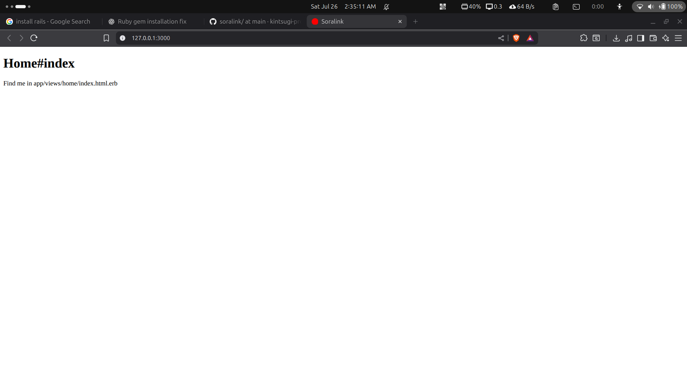
- change in app/views/home/index.html.erb, eg : hello world
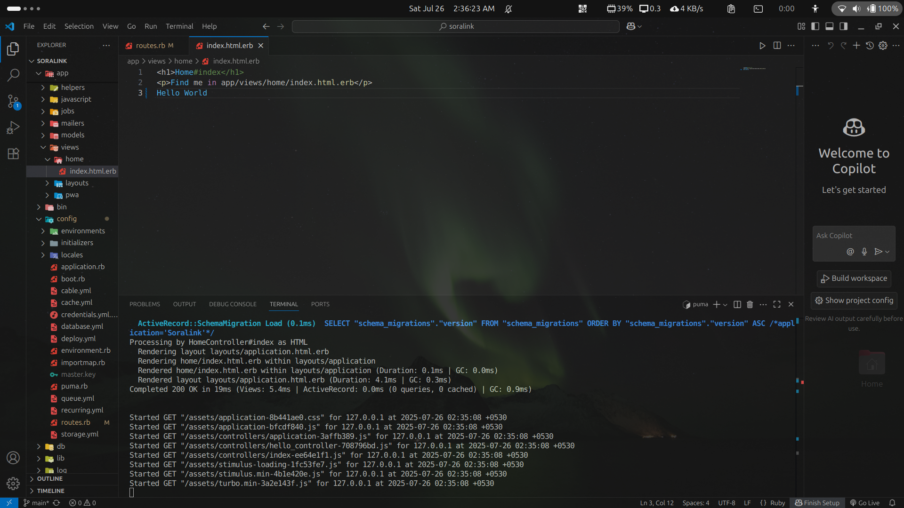
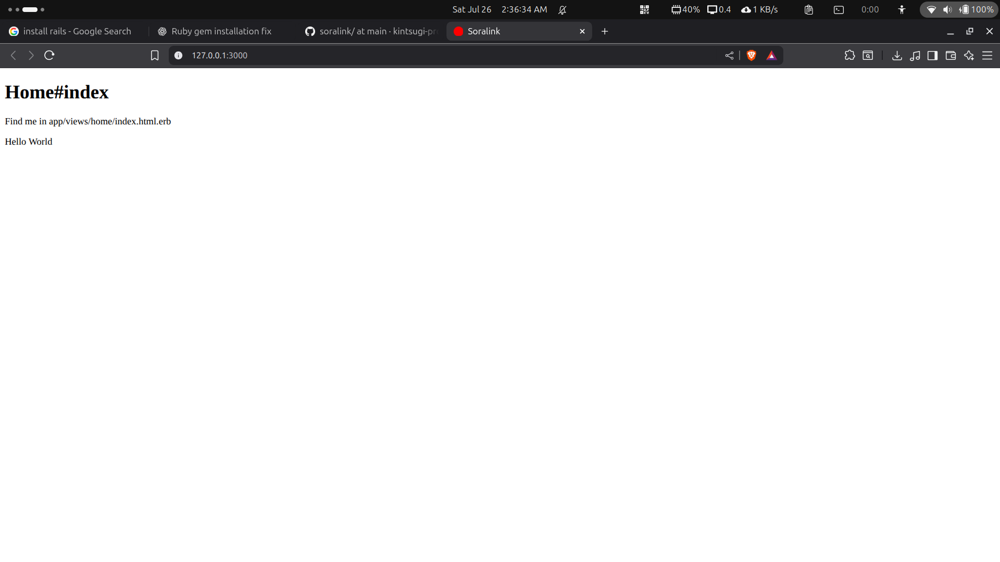

## First Scaffold with Rails
- will make you fall in love with rails
- Scaffolding makes your code 10x faster your pace
- Scaffolding let's you creat `CRUD` Layout in Rails, Foundation of any webapp
- create scaffold (named tree) & add attributes (name:string, x:string, instagram:string, youtube:string user_id:integer style:string)
```
rails g scaffold tree name:string x:string instagram:string youtube:string user_id:integer style:string
```
- after enter you will see madness of file creation
```
bali-king@war-machine:~/BaliGit/soralink$ rails g scaffold tree name:string x:string instagram:string youtube:string user_id:integer style:string
      invoke  active_record
      create    db/migrate/20250725211443_create_trees.rb
      create    app/models/tree.rb
      invoke    test_unit
      create      test/models/tree_test.rb
      create      test/fixtures/trees.yml
      invoke  resource_route
       route    resources :trees
      invoke  scaffold_controller
      create    app/controllers/trees_controller.rb
      invoke    erb
      create      app/views/trees
      create      app/views/trees/index.html.erb
      create      app/views/trees/edit.html.erb
      create      app/views/trees/show.html.erb
      create      app/views/trees/new.html.erb
      create      app/views/trees/_form.html.erb
      create      app/views/trees/_tree.html.erb
      invoke    resource_route
      invoke    test_unit
      create      test/controllers/trees_controller_test.rb
      create      test/system/trees_test.rb
      invoke    helper
      create      app/helpers/trees_helper.rb
      invoke      test_unit
      invoke    jbuilder
      create      app/views/trees/index.json.jbuilder
      create      app/views/trees/show.json.jbuilder
      create      app/views/trees/_tree.json.jbuilder
bali-king@war-machine:~/BaliGit/soralink$ 
```
- migrate the pending migration to the database, run this just after the scaffold command, vital important
```
rails db:migrate
```
```
bali-king@war-machine:~/BaliGit/soralink$ rails db:migrate
== 20250725211443 CreateTrees: migrating ======================================
-- create_table(:trees)
   -> 0.0010s
== 20250725211443 CreateTrees: migrated (0.0010s) =============================

bali-king@war-machine:~/BaliGit/soralink$ 
```
- i.e. this created `db/schema.rb`, this below is scaffold
```
# This file is auto-generated from the current state of the database. Instead
# of editing this file, please use the migrations feature of Active Record to
# incrementally modify your database, and then regenerate this schema definition.
#
# This file is the source Rails uses to define your schema when running `bin/rails
# db:schema:load`. When creating a new database, `bin/rails db:schema:load` tends to
# be faster and is potentially less error prone than running all of your
# migrations from scratch. Old migrations may fail to apply correctly if those
# migrations use external dependencies or application code.
#
# It's strongly recommended that you check this file into your version control system.

ActiveRecord::Schema[8.0].define(version: 2025_07_25_211443) do
  create_table "trees", force: :cascade do |t|
    t.string "name"
    t.string "x"
    t.string "instagram"
    t.string "youtube"
    t.integer "user_id"
    t.string "style"
    t.datetime "created_at", null: false
    t.datetime "updated_at", null: false
  end
end
```
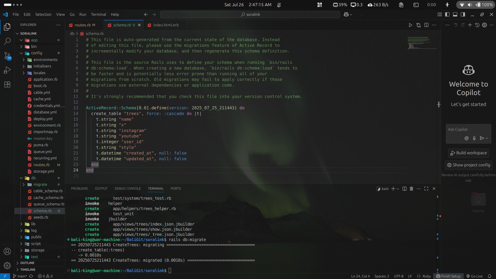
- these 2 below are default attributes in scaffold
```
    t.datetime "created_at", null: false
    t.datetime "updated_at", null: false
```
- it created new view,controller,modal named tree
  - `app/views/trees`
  - `app/models/tree.rb`
  - `app/controllers/trees_controller.rb`
- create new link to tree in `app/views/home/index.html.erb`
  - embedded ruby [RENDER OFF]`<%%>`
  - embedded ruby [RENDER ON] `<%= %>`
  - eg: create link `<%= link_to "New Tree", new_tree_path%>`
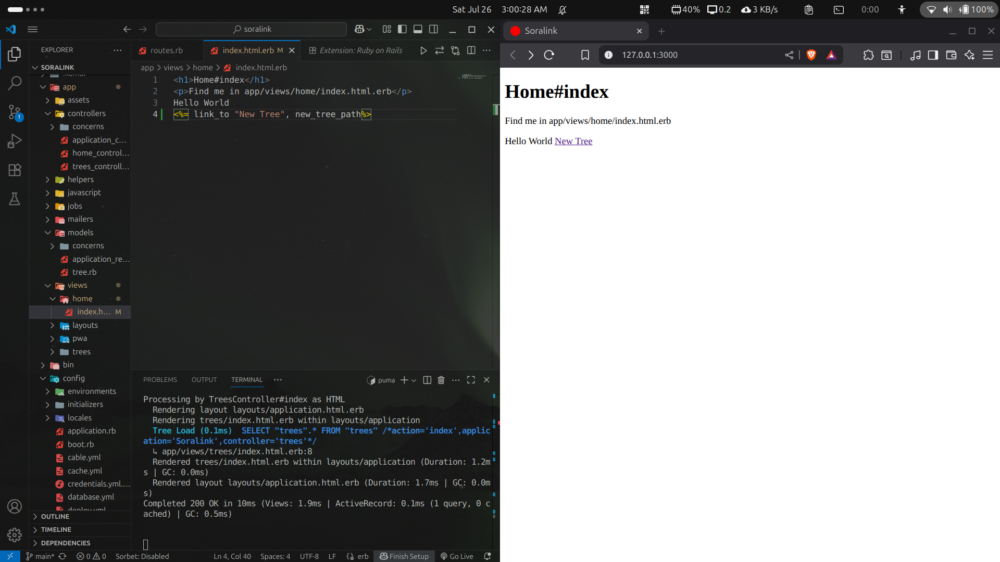
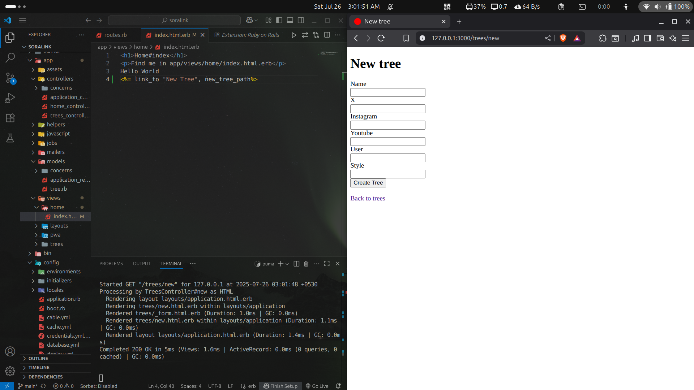
- now you can create new tree, edit it , destroy(delete) it
  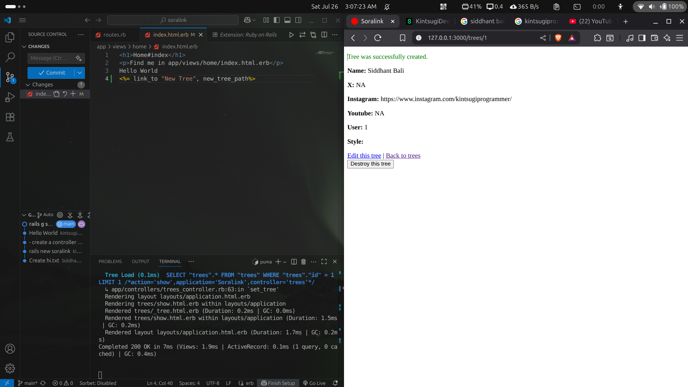
  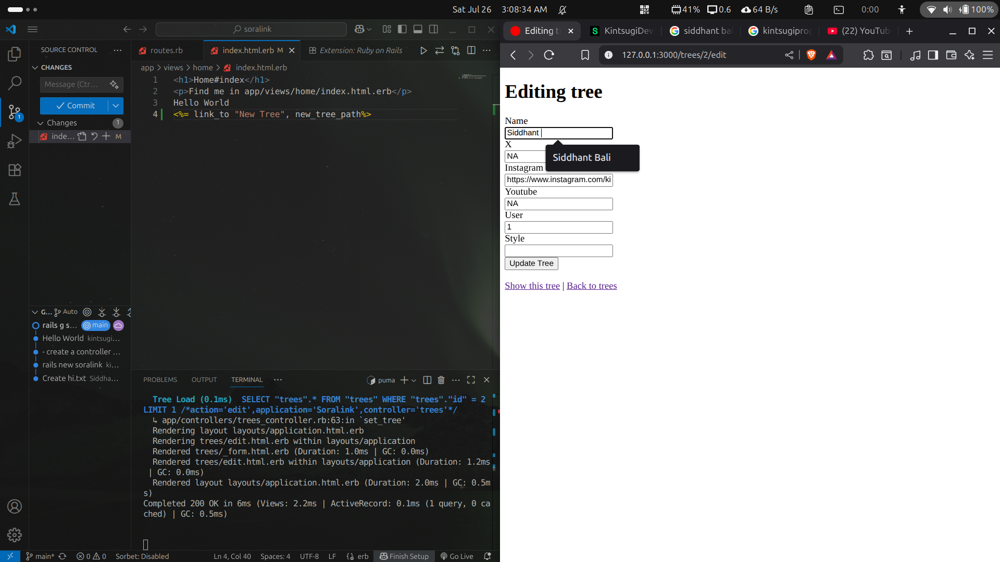
  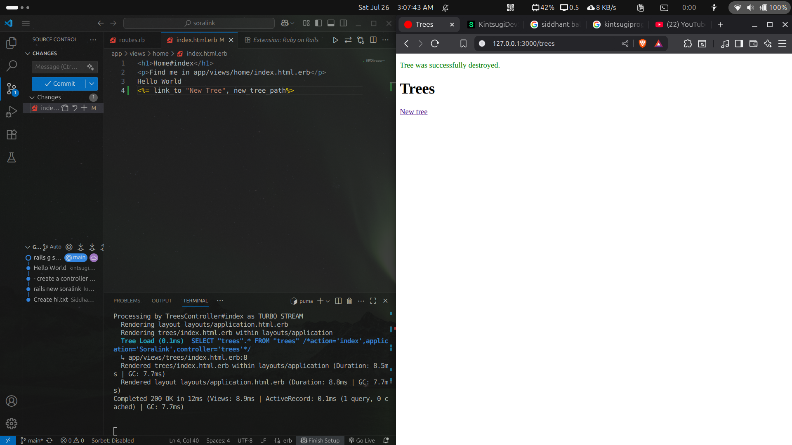
- created too many stuff with just one command !!!!!!

## Rails Routes
- `rails routes` : give you mountain full of routes
```
bali-king@war-machine:~/BaliGit/soralink$ rails routes
                                  Prefix Verb   URI Pattern                                                                                       Controller#Action
                                                /assets                                                                                           Propshaft::Server
                                   trees GET    /trees(.:format)                                                                                  trees#index
                                         POST   /trees(.:format)                                                                                  trees#create
                                new_tree GET    /trees/new(.:format)                                                                              trees#new
                               edit_tree GET    /trees/:id/edit(.:format)                                                                         trees#edit
                                    tree GET    /trees/:id(.:format)                                                                              trees#show
                                         PATCH  /trees/:id(.:format)                                                                              trees#update
                                         PUT    /trees/:id(.:format)                                                                              trees#update
                                         DELETE /trees/:id(.:format)                                                                              trees#destroy
                              home_index GET    /home/index(.:format)                                                                             home#index
                      rails_health_check GET    /up(.:format)                                                                                     rails/health#show
                                    root GET    /                                                                                                 home#index
        turbo_recede_historical_location GET    /recede_historical_location(.:format)                                                             turbo/native/navigation#recede
        turbo_resume_historical_location GET    /resume_historical_location(.:format)                                                             turbo/native/navigation#resume
       turbo_refresh_historical_location GET    /refresh_historical_location(.:format)                                                            turbo/native/navigation#refresh
           rails_postmark_inbound_emails POST   /rails/action_mailbox/postmark/inbound_emails(.:format)                                           action_mailbox/ingresses/postmark/inbound_emails#create
              rails_relay_inbound_emails POST   /rails/action_mailbox/relay/inbound_emails(.:format)                                              action_mailbox/ingresses/relay/inbound_emails#create
           rails_sendgrid_inbound_emails POST   /rails/action_mailbox/sendgrid/inbound_emails(.:format)                                           action_mailbox/ingresses/sendgrid/inbound_emails#create
     rails_mandrill_inbound_health_check GET    /rails/action_mailbox/mandrill/inbound_emails(.:format)                                           action_mailbox/ingresses/mandrill/inbound_emails#health_check
           rails_mandrill_inbound_emails POST   /rails/action_mailbox/mandrill/inbound_emails(.:format)                                           action_mailbox/ingresses/mandrill/inbound_emails#create
            rails_mailgun_inbound_emails POST   /rails/action_mailbox/mailgun/inbound_emails/mime(.:format)                                       action_mailbox/ingresses/mailgun/inbound_emails#create
          rails_conductor_inbound_emails GET    /rails/conductor/action_mailbox/inbound_emails(.:format)                                          rails/conductor/action_mailbox/inbound_emails#index
                                         POST   /rails/conductor/action_mailbox/inbound_emails(.:format)                                          rails/conductor/action_mailbox/inbound_emails#create
       new_rails_conductor_inbound_email GET    /rails/conductor/action_mailbox/inbound_emails/new(.:format)                                      rails/conductor/action_mailbox/inbound_emails#new
           rails_conductor_inbound_email GET    /rails/conductor/action_mailbox/inbound_emails/:id(.:format)                                      rails/conductor/action_mailbox/inbound_emails#show
new_rails_conductor_inbound_email_source GET    /rails/conductor/action_mailbox/inbound_emails/sources/new(.:format)                              rails/conductor/action_mailbox/inbound_emails/sources#new
   rails_conductor_inbound_email_sources POST   /rails/conductor/action_mailbox/inbound_emails/sources(.:format)                                  rails/conductor/action_mailbox/inbound_emails/sources#create
   rails_conductor_inbound_email_reroute POST   /rails/conductor/action_mailbox/:inbound_email_id/reroute(.:format)                               rails/conductor/action_mailbox/reroutes#create
rails_conductor_inbound_email_incinerate POST   /rails/conductor/action_mailbox/:inbound_email_id/incinerate(.:format)                            rails/conductor/action_mailbox/incinerates#create
                      rails_service_blob GET    /rails/active_storage/blobs/redirect/:signed_id/*filename(.:format)                               active_storage/blobs/redirect#show
                rails_service_blob_proxy GET    /rails/active_storage/blobs/proxy/:signed_id/*filename(.:format)                                  active_storage/blobs/proxy#show
                                         GET    /rails/active_storage/blobs/:signed_id/*filename(.:format)                                        active_storage/blobs/redirect#show
               rails_blob_representation GET    /rails/active_storage/representations/redirect/:signed_blob_id/:variation_key/*filename(.:format) active_storage/representations/redirect#show
         rails_blob_representation_proxy GET    /rails/active_storage/representations/proxy/:signed_blob_id/:variation_key/*filename(.:format)    active_storage/representations/proxy#show
                                         GET    /rails/active_storage/representations/:signed_blob_id/:variation_key/*filename(.:format)          active_storage/representations/redirect#show
                      rails_disk_service GET    /rails/active_storage/disk/:encoded_key/*filename(.:format)                                       active_storage/disk#show
               update_rails_disk_service PUT    /rails/active_storage/disk/:encoded_token(.:format)                                               active_storage/disk#update
                    rails_direct_uploads POST   /rails/active_storage/direct_uploads(.:format)                                                    active_storage/direct_uploads#create
bali-king@war-machine:~/BaliGit/soralink$ 
```
- here we have
  - 2 actual routes
    - `trees#create new_tree GET    /trees/new(.:format)`
    - `home#index rails_health_check GET    /up(.:format)`
  - rest variable routes, dynamic, contains `:id` 
    - eg : `trees#show PATCH  /trees/:id(.:format)`
- routes always end with `:path`

## Add User Auth 
- sign up, log in
- with ruby gem `devise`: flexible auth sol for rails with warden
  - `bundle add device`
  - or add it to Gemfile
    - add this in bottom of Gemfile
    ```
    # My Custom Gems
    gem 'devise'
    gem 'brypt' # prereq of devise
    ```
    - then in terminal: `bundle install` (this will update the Gemfile)
- ruby gem : libraries consist of production tools in community to code faster, rubygems.org(for ruby,but most of them also works with rails)
- Gemfile : index consists all of our packages 
- bundle install : gem with fetch gems metadata from offcial rubygems.org server and install , install it using `sudo gem install bundler`
- then in terminal: `bundle install` (this will update the Gemfile)
- if any permission error
  ```
  bundle config set --local path 'vendor/bundle'
  bundle install
  ```
  or use `sudo bundle install`

- devise 
  - followup from doc
  - `rails generate devise:install` runs generator of devise
  - also gives some instructions for manual setup depending on app's configuration 
    - 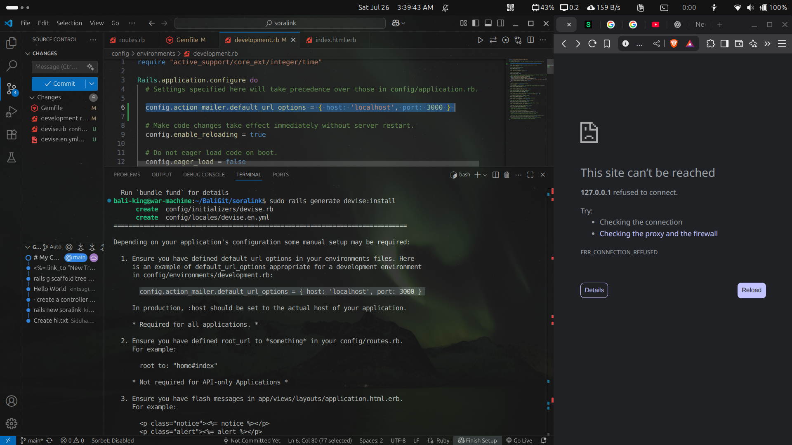
    - 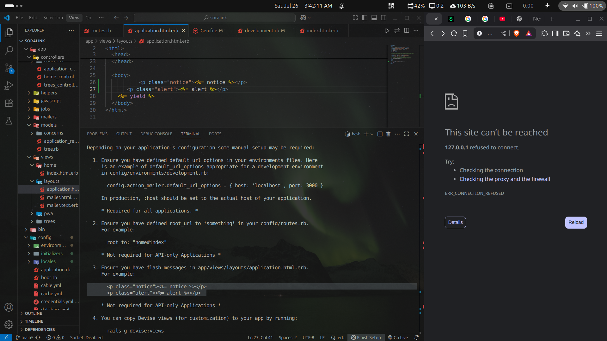
    - `app/views/layouts/application.html.erb` it renders every other view [IMP]
    ```
    bali-king@war-machine:~/BaliGit/soralink$ rails g devise:views
      invoke  Devise::Generators::SharedViewsGenerator
      create    app/views/devise/shared
      create    app/views/devise/shared/_error_messages.html.erb
      create    app/views/devise/shared/_links.html.erb
      invoke  form_for
      create    app/views/devise/confirmations
      create    app/views/devise/confirmations/new.html.erb
      create    app/views/devise/passwords
      create    app/views/devise/passwords/edit.html.erb
      create    app/views/devise/passwords/new.html.erb
      create    app/views/devise/registrations
      create    app/views/devise/registrations/edit.html.erb
      create    app/views/devise/registrations/new.html.erb
      create    app/views/devise/sessions
      create    app/views/devise/sessions/new.html.erb
      create    app/views/devise/unlocks
      create    app/views/devise/unlocks/new.html.erb
      invoke  erb
      create    app/views/devise/mailer
      create    app/views/devise/mailer/confirmation_instructions.html.erb
      create    app/views/devise/mailer/email_changed.html.erb
      create    app/views/devise/mailer/password_change.html.erb
      create    app/views/devise/mailer/reset_password_instructions.html.erb
      create    app/views/devise/mailer/unlock_instructions.html.erb
    bali-king@war-machine:~/BaliGit/soralink$ 
    ```
- `rails generate devise MODEL` here naming user as MODEL
- then `rails db:migrate`
```
bali-king@war-machine:~/BaliGit/soralink$ rails generate devise user
      invoke  active_record
      create    db/migrate/20250725223932_devise_create_users.rb
      create    app/models/user.rb
      invoke    test_unit
      create      test/models/user_test.rb
      create      test/fixtures/users.yml
      insert    app/models/user.rb
       route  devise_for :users
bali-king@war-machine:~/BaliGit/soralink$ rails db:migrate
== 20250725223932 DeviseCreateUsers: migrating ================================
-- create_table(:users)
   -> 0.0010s
-- add_index(:users, :email, {:unique=>true})
   -> 0.0006s
-- add_index(:users, :reset_password_token, {:unique=>true})
   -> 0.0006s
== 20250725223932 DeviseCreateUsers: migrated (0.0023s) =======================

bali-king@war-machine:~/BaliGit/soralink$ 
```
- we're not done yet
- we want that , whenever someone click new tree, it directs to auth. part
  - by just one line in rubyonrails
  - `before_action :authenticate_user!` inside `app/controllers/trees_controller.rb` WOW
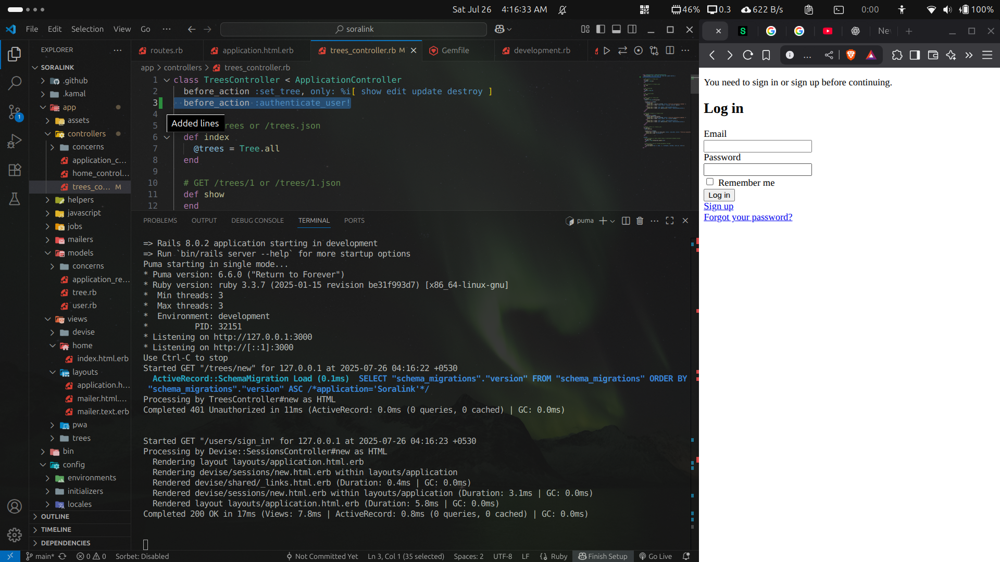

- just like
```
  before_action :set_tree, only: %i[ show edit update destroy ] #only show edit update destroy is executed by method set_tree
```
then do similar to auth
```
  before_action :authenticate_user!, only: %i[ new edit update destroy ] #only new edit update destroy is executed by method authenticate_user
```
- we actually restrict it , now when we go to page , and IFF make a tree, then only auth comes
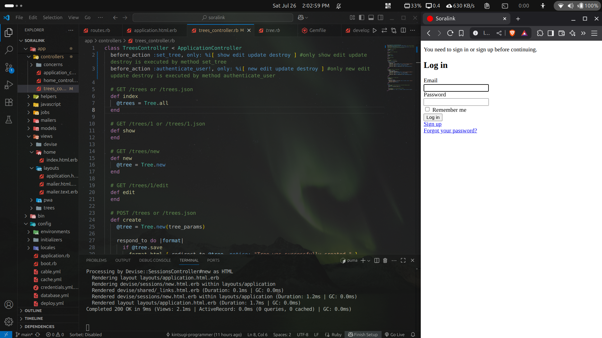
- auth done
- you can create acc and log in
- but still you need Login/Logout Buttion Navigation

## Add Navbar Partial
- partials are created only in layout and views folder `app/views/layouts`
  - `newfile.html.erb` is ruby-html file extension
  - partial [RENDEROFF] = `newfile.html.erb`
  - partial [RENDERON] = `_newfile.html.erb`
- now create `app/views/layouts/_navbar.html.erb` and write in it `Hi I am a Navbar`
- now code this `<%= render "layouts/navbar"%>` inside body of `app/views/layouts/application.html.erb`,as whatever renders in this page will render on every other page
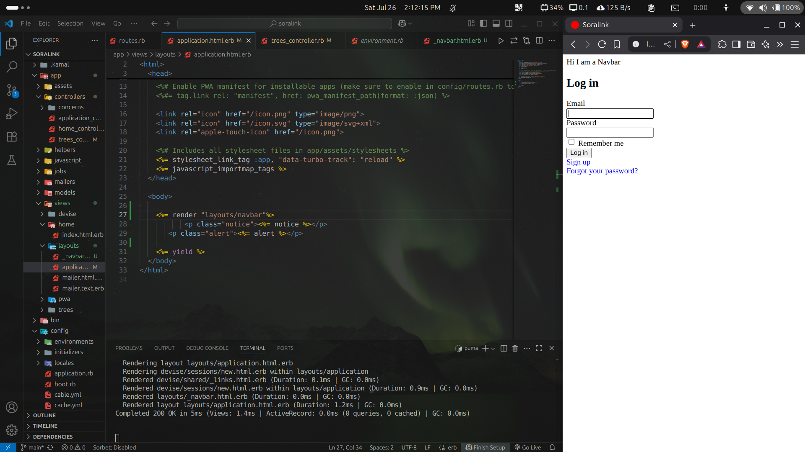
- tada
- now we have to make links of signup, signin, logout
- `<%= link_to "Sign up",new_user_registration_path %>` in `app/views/layouts/_navbar.html.erb`, its a link_to with "name", path of new user registration , which can be found by `rails routes`,
`new_user_registration GET    /users/sign_up(.:format)        devise/registrations#new`,but write `new_user_registration` as `new_user_registration_path` ,add `_path`
- sign up works
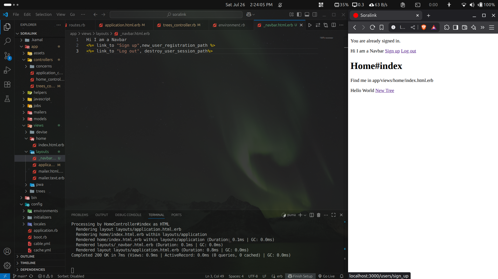
- `<%= link_to "Log out", destroy_user_session_path%> ` in `app/views/layouts/_navbar.html.erb`, but log out didn't work,error `No route matches [GET] "/users/sign_out"`
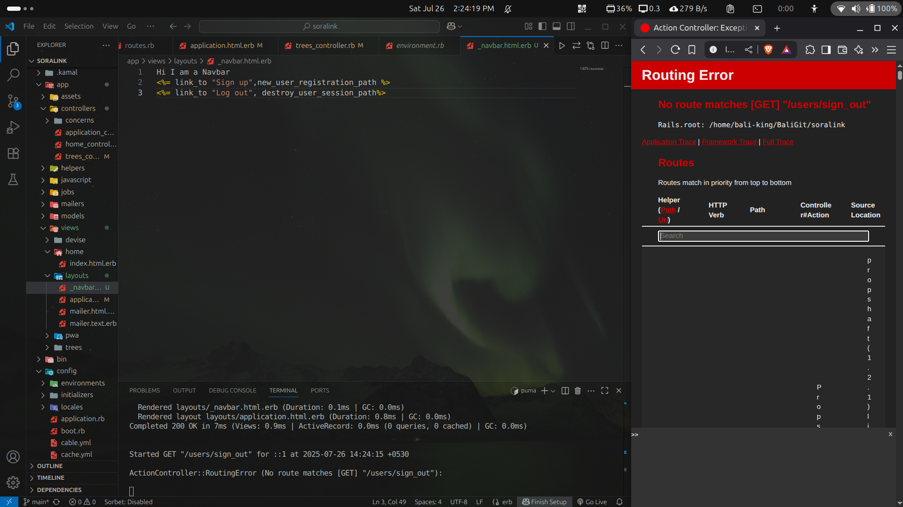
  - solution: add route that matches this
  - 32:58 https://www.youtube.com/watch?v=Ei4Aa6RJTyo&list=PLR8BLHNyVZDVkZHDbm2mSL4RMISIBuBqs&index=4


# README

This README would normally document whatever steps are necessary to get the
application up and running.

Things you may want to cover:

* Ruby version

* System dependencies

* Configuration

* Database creation

* Database initialization

* How to run the test suite

* Services (job queues, cache servers, search engines, etc.)

* Deployment instructions

* ...
